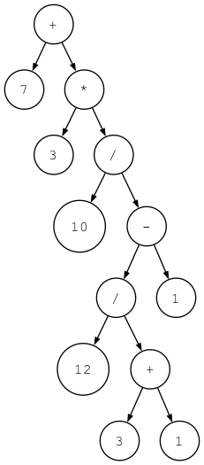

# simple_interpreter
simple demo for python interpreter 

一个用 python 实现的简单解释器，支持解释 python 代码

分版本逐步实现完整功能，适合初学者学习解释器的工作原理

## 版本说明
### v1.0 : only support single-digit integers +
支持加法运算
### v2.0 : support multi-digit integers +/-, support process whitespace
支持加法减法，支持处理表达式中的空格
### v3.0 : support to parse (recognize) and interpret arithmetic expressions that have any number of plus or minus operators in it, for example “7 - 3 + 2 - 1”.
支持包含多个数字的加减表达式
### v4.0 : support to parse and interpret arithmetic expressions with any number of multiplication and division operators in them, for example “7 * 4 / 2 * 3”
支持包含多个数字的乘除表达式
### v5.0 : support to handle valid arithmetic expressions containing integers and any number of addition, subtraction, multiplication, and division operators.
支持包含多个数字的加减乘除混合表达式
### v6.0 : support to evaluates arithmetic expressions that have different operators and parentheses.
支持包含括号的混合表达式处理
### v7.0 : using ASTs represent the operator-operand model of arithmetic expressions.
支持使用 AST (abstract syntax tree 抽象语法树）来表示算术表达式
#### 语法树可视化
```shell
python genastdot.py "7 + 3 * (10 / (12 / (3 + 1) - 1))" > ast.dot && dot -Tpng -o ast.png ast.dot
```


执行之前需要先按照dot, 参考：https://graphviz.org/ 