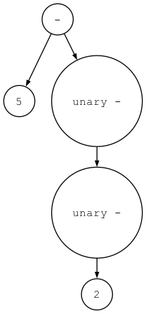

# simple_interpreter (A python interpreter implemented in python.)
一个用 python 实现的简单python解释器，分版本（与分支对应）逐步实现一个简单的python解释器功能，适合初学者了解解释器的工作原理

## 版本说明
为了方便渐进式学习进度，每一个版本都创建了一个独立的分支，比如 v1.0版本对应的分支名为 v1.0, 该分支只实现了 v1.0 的功能，以此类推，逐步进行功能迭代。
### v1.0 
only support single-digit integers +

支持整数的加法运算
### v2.0 
support multi-digit integers +/-, support process whitespace

支持加法减法，支持处理表达式中的空格
### v3.0 
support to parse (recognize) and interpret arithmetic expressions that have any number of plus or minus operators in it, for example “7 - 3 + 2 - 1”.

支持包含多个数字的加减表达式
### v4.0 
support to parse and interpret arithmetic expressions with any number of multiplication and division operators in them, for example “7 * 4 / 2 * 3”

支持包含多个数字的乘除表达式
### v5.0 
support to handle valid arithmetic expressions containing integers and any number of addition, subtraction, multiplication, and division operators.

支持包含多个数字的加减乘除混合表达式
### v6.0 
support to evaluates arithmetic expressions that have different operators and parentheses.

支持包含括号的混合表达式处理
### v7.0 
using ASTs represent the operator-operand model of arithmetic expressions.
支持使用 AST (abstract syntax tree 抽象语法树）来表示算术表达式
#### 语法树可视化
```shell
python genastdot.py "7 + 3 * (10 / (12 / (3 + 1) - 1))" > ast.dot && dot -Tpng -o ast.png ast.dot
```


执行之前需要先按照dot, 参考：https://graphviz.org/ 

### v8.0 
support unary operators (+, -)
```shell
 python genastdot.py "5---2" > ast.dot && dot -Tpng -o ast_v8.png ast.dot    
```



### v9.0 
support to handle python assignment statements.

```shell
python interpreter.py assignments.txt
```

```shell
python genastdot.py assignments.txt > ast.dot && dot -Tpng -o ast_v9.png ast.dot  
```